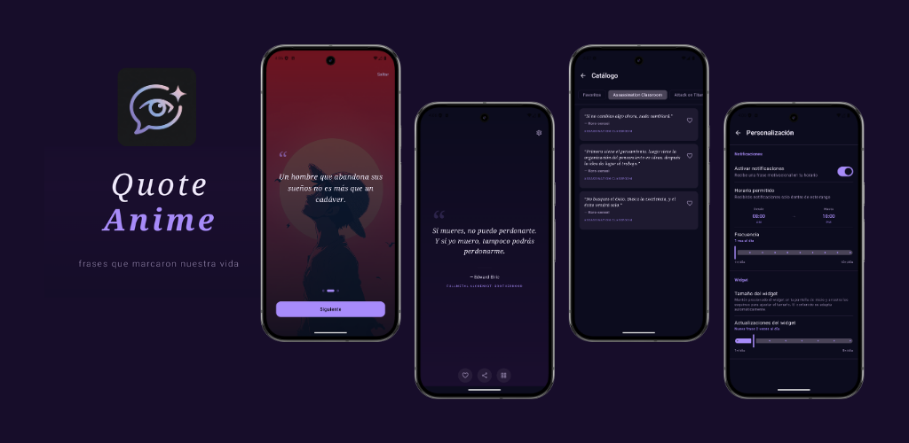

<!-- Icons: https://simpleicons.org | Slugs: https://github.com/simple-icons/simple-icons/blob/develop/slugs.md -->

  <h1>Hi 👋, I'm Gonzalo</h1>
  
Mobile Developer · Android & iOS · Passionate about AI in mobile solutions

  

    <a href="https://youtube.com/GonzaloDroid2050?sub_confirmation=1">📺 YouTube</a> &nbsp;|&nbsp;
    <a href="https://www.instagram.com/gonzalo.lozg/">📸 Instagram</a> &nbsp;|&nbsp;
    <a href="https://www.tiktok.com/@gonzalodroid">🎵 TikTok</a> &nbsp;|&nbsp;
    <a href="https://gonzalo-lozg.me/">🌐 Portfolio</a>
  

  
  

---

### 👤 About Me

- 📲 Android & iOS developer with Kotlin and Swift
- 🌱 Passionate about sharing my journey with the community, constantly learning
- ☁️ AI is transforming the world — I love exploring its potential in mobile solutions
- 🚀 Continuous learner, always exploring new tech applications
- 🎥 I build apps and face challenges, sharing everything with the community
- 🌐 Check out my [Portfolio](https://gonzalo-lozg.me/)

---

### 🛠 Tech Stack

<table>
  <tr>
    <td valign="top" width="50%">
      <b>📱 Android</b>  
      
      
      
      
      
    </td>
    <td valign="top" width="50%">
      <b>🍎 iOS</b>  
      
      
    </td>
  </tr>
  <tr>
    <td valign="top">
      <b>🌐 Multiplatform</b>  
      
      
    </td>
    <td valign="top">
      <b>🔧 Tools & Services</b>  
      
      
      
    </td>
  </tr>
</table>

---

### 📱 My Apps

<table>
  <tr>
    <td>
      <h3>Quote Anime | Frases Anime</h3>
      
Discover and share inspiring quotes from your favorite anime. Browse by category, save your favorites, and receive daily quotes via notifications or your home screen widget.

      

        
        
        
        
        
      

      

        
        
        
      

      
    </td>
  </tr>
  <tr>
    <td>
      <h3>AutoTest Licencia</h3>
      
Practice for your driving license exam. Review an updated and categorized question bank, take simulation tests, and track your results.

      

        
        
        
        
        
      

      

        
      

      
    </td>
  </tr>
</table>

---

### ⚙️ GitHub Analytics

  

